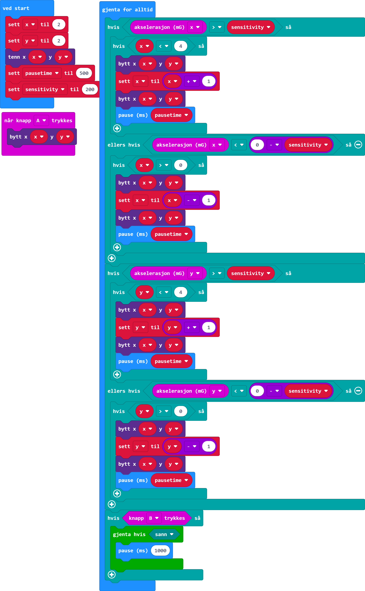

<i>Norsk beskrivelse under</i>

# Draw with micro:bit
This project is based on the [Draw with micro:bit!](https://www.youtube.com/watch?v=b2iVefVTleI) video on the Nordic Semiconductor Student Projects Youtube page.

# Code

# Tegn med micro:bit
Dette prosjektet er basert på [Tegn med micro:bit!](https://www.youtube.com/watch?v=b2iVefVTleI) videoen på Nordic Semiconductor Student Projects sin Youtube side.

 # Kode
