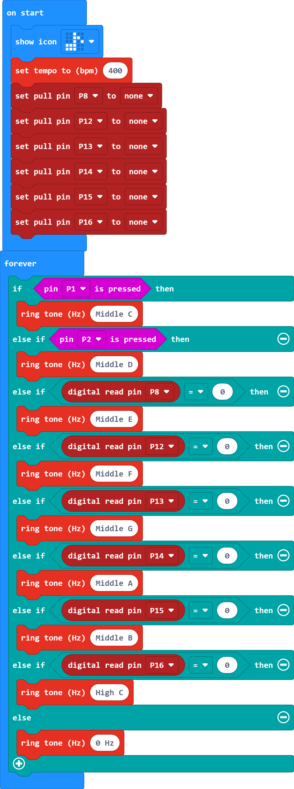
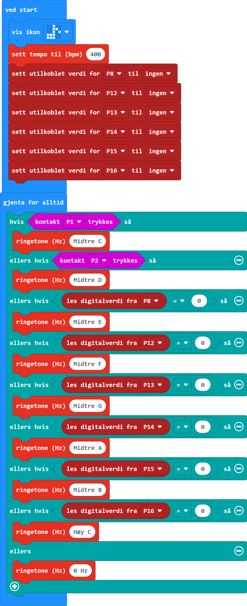

<i>Norsk beskrivelse under</i>

# Piano
This project is based on the [Piano with micro:bit!](https://www.youtube.com/watch?v=ulKq5To9dmA) video on the Nordic Semiconductor Student Projects Youtube page. Minor changes were made in this version.

## Materials
* 1 micro:bit, battery pack and batteries
* 1 breakout board for micro:bit (I used [this one](https://www.digikey.no/no/products/detail/kitronik-ltd/5601B/8635481))
* 1 breadboard (I used [this one](https://www.digikey.no/no/products/detail/adafruit-industries-llc/4539/12082396))
* 6 10M ohm resistors
* Aluminum foil
* 9 Crocodile clips
* Jumper cables
* Scissor
* Glue

## Instructions

You can follow the guide in the YouTube video for how to create the piano and connect the wires. If you are using micro:bit v1 you will need a small speaker as well, but if you are using v2 then you can use the in-built speaker.

## Code
The code is almost the same as the one in the video. The difference is that this version does not show what notes are played, as in later versions of Makecode this caused a delay which made the notes play for too long.

# Piano

Dette prosjektet er basert på [Piano med micro:bit!](https://www.youtube.com/watch?v=ulKq5To9dmA) videoen på Nordic Semiconductor Student Projects sin Youtube side. Noen små endringer er gjort i denne versjonen.

## Utstyrsliste
* 1 micro:bit, batteripakke og batteri
* 1 breakout-kretskort (jeg brukte [dette](https://www.digikey.no/no/products/detail/kitronik-ltd/5601B/8635481))
* 1 breadboard/koblingsbrett (jeg brukte [dette](https://www.digikey.no/no/products/detail/adafruit-industries-llc/4539/12082396))
* 6 10M ohm motstander
* 9 krokodilleklemmer
* Jumperkabler/ledninger
* Saks
* Lim

## Instruksjoner

Du kan følge instruksjonene i Youtube-videoen for hvordan å lage pianoet og koble ledningene. Hvis du bruker micro:bit v1 trenger du også en liten høyttaler, men med v2 kan du bruke den innebygde høyttaleren.

## Kode
Koden er nesten helt lik den i videoen. Forskjellen er at denne versjonen ikke viser hvilke noter som blir spilt, ettersom i nyere versjoner av Makecode så fører dette til en pause som gjør at notene spiller for lenge.

