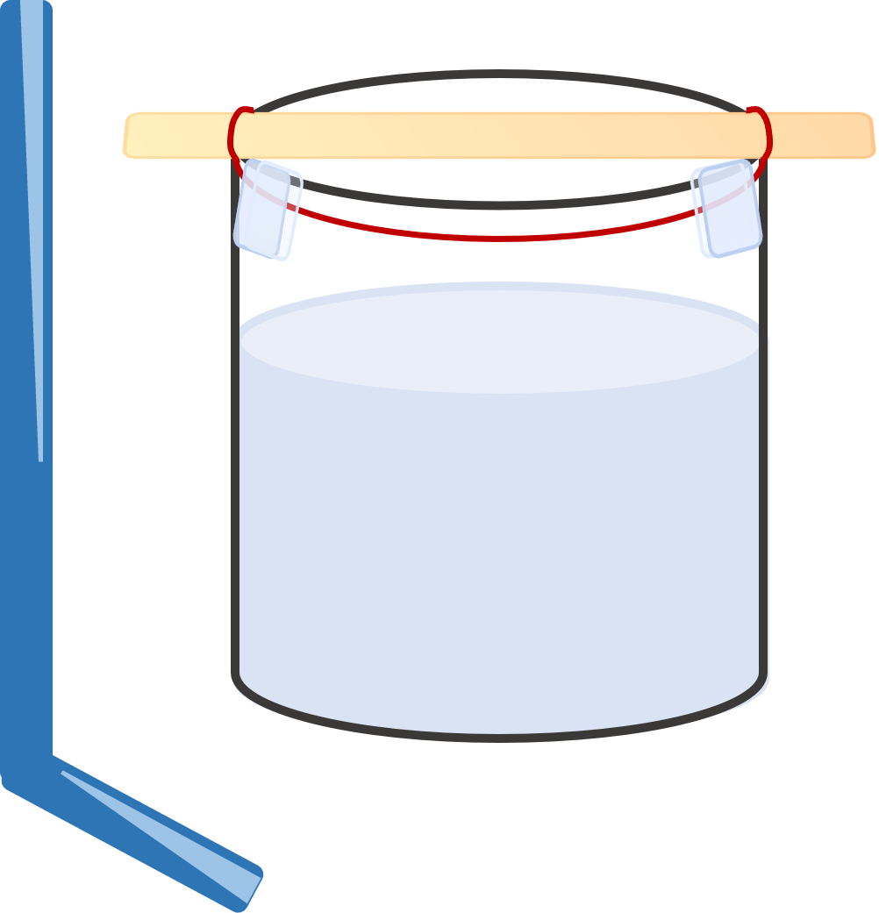
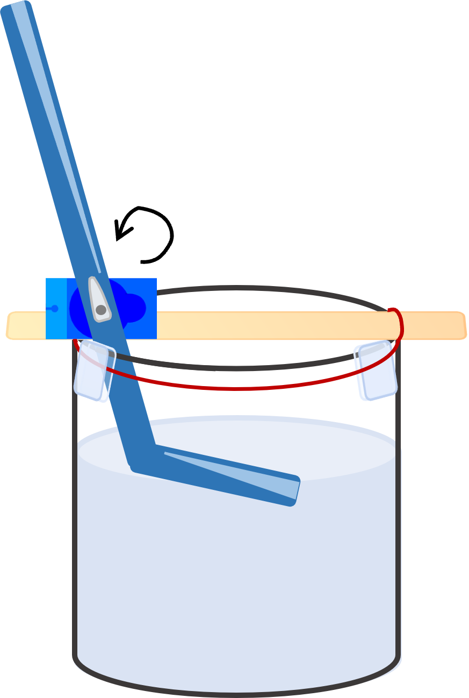
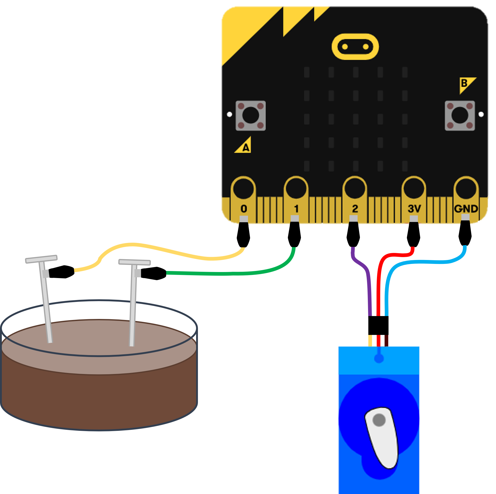
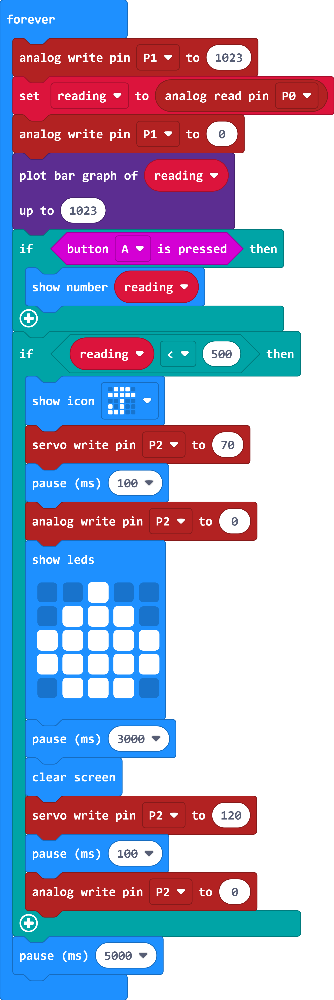

<i>Norsk beskrivelse under</i>

# Automatic plant watering

This demo is based on [this Plant Watering](https://makecode.microbit.org/projects/plant-watering) project. 

## Materials
* Micro:bit, battery pack and batteries
* 1 micro servo (I used [this one](https://www.digikey.no/no/products/detail/dfrobot/SER0037/7087144))
* Crocodile clips:
    * 5 crocodile clips + 3 male-to-male jumper cables OR
    * 2 crocodile clips + 3 male-to-crocodile clips
* 2 nails
* 2 elastics
* 1 straw
* 1 ice cream stick
* tape roll
* scissors

You can find the instructions for how to build the plant waterer and connect the cables in the [micro:bit plant watering video](https://youtu.be/7eC_VjH1eP0). You can also find pictures that illustrate how to connect things below.

# Code

# Automatisk plantevanner

## Utstyr
* Micro:bit, batteripakke og batteri
* 1 micro servo (jeg brukte [denne](https://www.digikey.no/no/products/detail/dfrobot/SER0037/7087144))
* Krokodilleklemmer:
    * 5 krokodilleklemmer + 3 hann-til-hann kabler ELLER
    * 2 krokodilleklemmer + 3 hann-til-krokodille
* 2 spiker
* 2 gummistrikk
* 1 sugerør
* 1 ispinne
* teip
* saks

## Framgangsmåte

Du kan finne instruksjoner for hvordan bygge plantevanneren og koble kablene i [micro:bit plantevanner-videoen](https://youtu.be/7eC_VjH1eP0). Du finnerogså bilder som illustrerer hvordan sette sammen tingene under.

## Kode

