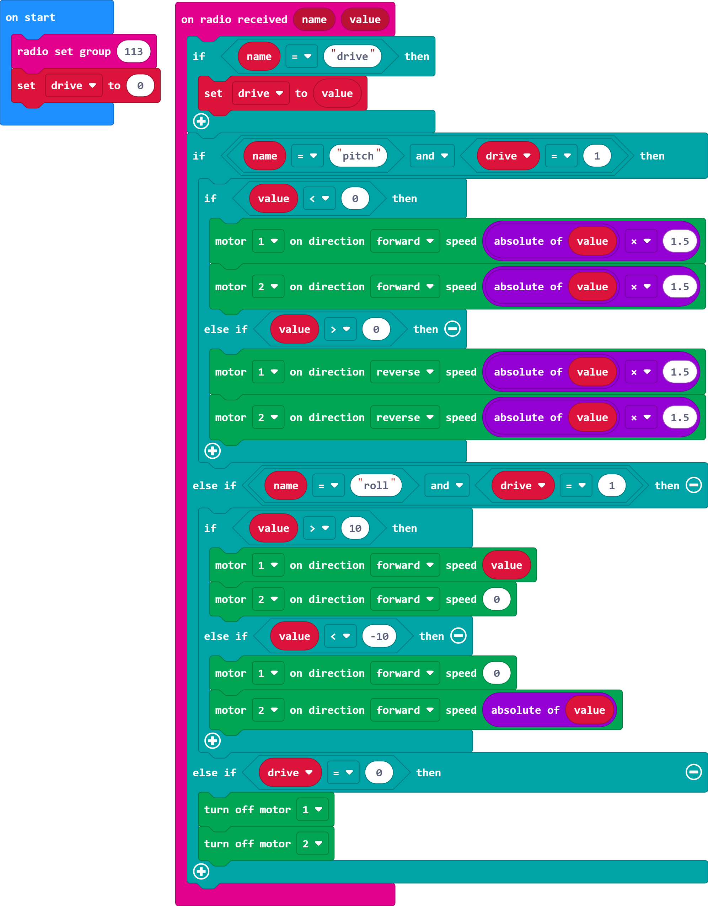
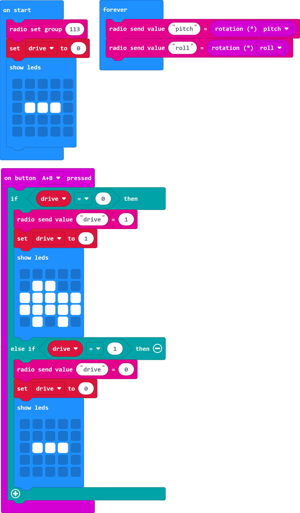
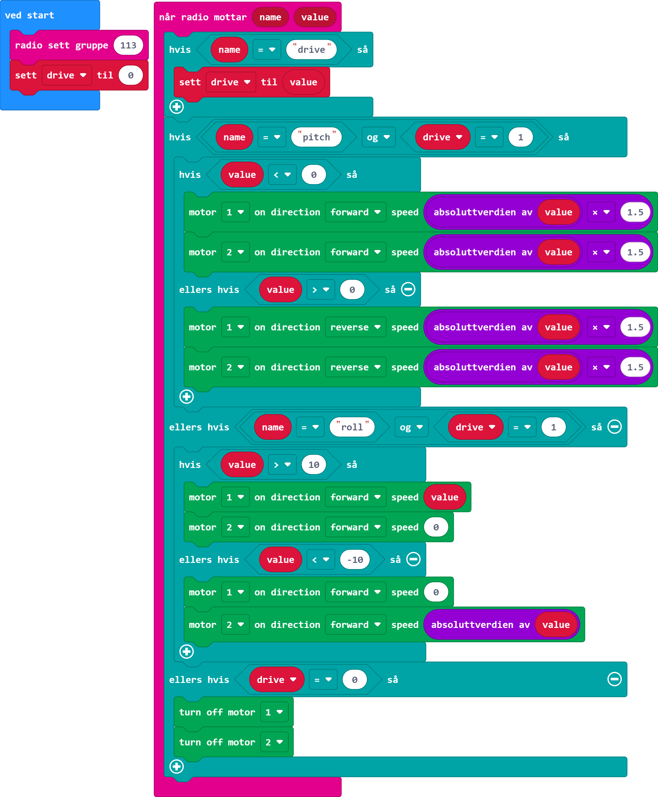
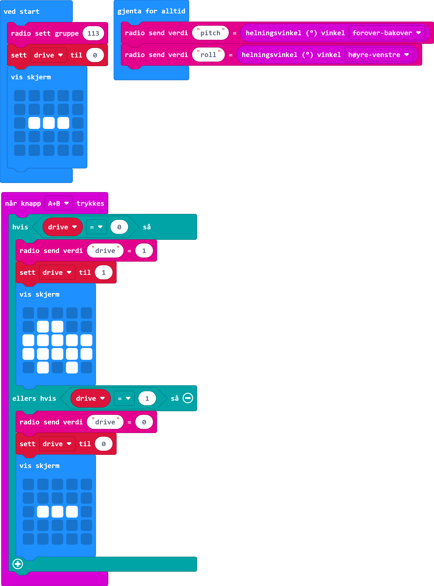

<i>Norsk beskrivelse under</i>

# Radio controlled car
## Materials
* 2 micro:bit, 2 battery packs and batteries
* 1 Motor driver board (I used [this one](https://kitronik.co.uk/products/5620-motor-driver-board-for-the-bbc-microbit-v2))
* 2 wheels
* 2 DC motors
* 1 ball caster

You can buy the wheels, motors and ball caster separately, or you can buy a kit such as the [Jetbot chassis kit](https://www.digikey.no/no/products/detail/sparkfun-electronics/ROB-17279/13677596) or similar. You can also find several other kits for radio controlled micro:bit cars where you get all you need in the kit.

## Code
### Car

### Controller

# Radiostyrt bil

## Utstyrsliste
* 2 micro:bit, 2 batteripakker og batteri
* 1 motordriverkort (jeg brukte [dette](https://kitronik.co.uk/products/5620-motor-driver-board-for-the-bbc-microbit-v2))
* 2 hjul
* 2 DC-motorer
* 1 kulehjul

Du kan kjøpe hjul, motor og kulehjul separat, eller du kan kjøpe et sett som [Jetbot chassis kit](https://www.digikey.no/no/products/detail/sparkfun-electronics/ROB-17279/13677596) eller lignende. Det finnes også mange andre sett for radiostyrte micro:bit-biler hvor man får med alt man trenger.

## Kode
### Bil

### Kontroller

